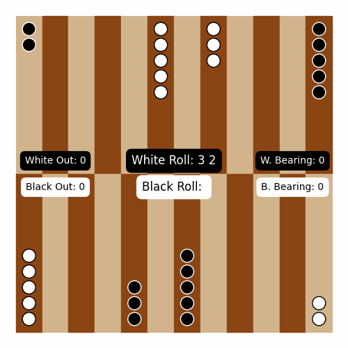

# BackgammonNN - *Osama Dabbousi and Vishesh Jain*

## Introduction
Backgammon is an incredibly interesting game to teach an AI to play.
The high branching factor caused by its dice rolls means that many traditional AI methods such as Monte Carlo Tree Search are not as effective as they are on more deterministic games such as chess. 
Inspired by the chess turbo-champ algorithm created by Alan turing, and TD-gammon for backgammon, the goal of this project was to implement three different styles of AI:
a single turn informed heuristic, a heuristic based MCTS, and a Neural Network based MCTS to compare their relative success rates. 

## Demo

The above is a visualization of a game played between the MCTS and itself rendered using matplotlib's funcanimation
library.

## Methodology
### Creating Backgammon
The first step in creating these systems was a program that handled the mechanisms of a game of backgammon.
The data of a given board state is stored in an array that contains the location of pieces on the board, the number of pieces beared off/out, and whose turn it is.
From there, two functions were created to handle the games control flow: the first generated all possible moves from a given board state/roll, and the other controls turns/input selection, as well as checking for wins/losses.

### Heuristic
The heuristic was created through repetitive intentional play of backgammon, as well as readings on the contemporary consensus of correct play.
These games and readings led us to find the following factors to be most significant:
1. Bearing pieces off is good, losing pieces is bad
2. Positions that protect your pieces are better those that don't
3. Having multiple protected stacks of 2-3 is more valuable than a single stack of 6+
4. Having a 5-prime or 6-prime is an incredibly valuable position that can lock your opponent out entirely
5. A lone "blot" is more threatened the closer it is to opponent pieces

As a result of these findings, we created a heuristic that valued a position accordingly based off these criteria, but also inversely valued when your opponent did the same. 
The weights given to each of these values were chosen largely arbitrarily, using our understanding of the game to decide for example whether keeping a piece safe or taking out an opponents piece should be more valuable. 

### Monte Carlo Tree Search
The tree search was the most complex part of this program. While traditional MCTS is already a complex system, the probabilistic MCTS used on backgammon has an additional layer of complexity created by the random branching nature of the dice rolls.
While in a normal MCTS, we create nodes representing potential board states and then choose states based off an equation like in an Upper Confidence Tree, probabilistic MCTS also has to create chance nodes that represent the random "choice" made by the dice on any given turn.
Since the rolls are entirely out of our control, we randomly choose a new dice roll at each step of the tree and simulate the remaining steps using these rolls.
Finally it values the boards states at each node based off the heuristic we created. 

### Neural Network
The array structure of the board lent itself most to a traditional fully connected network.
So, we created a regression model that attempts to predict the win probability of a given board state. 
To generate training data we simulated hundreds of thousands of games between random opponents, and tracked how often a given board state ended with a win for white. 
The main issues with this method were that random opponents often didn't take advantage of advantageous board-states, and that of the ~1 million board states we saw, less than 10% of them had been seen more than twice, meaning any data on them was largely meaningless.

## Results
As a benchmark comparison between the three methods, we played them each 100 games against a random opponent. Hoping for at least a win-rate of 85%
We found the following results:
1. Heuristic: 95%
2. MCTS: 96%
3. Neural network: 70%

The MCTS and heuristic were largely successful, though the heuristic was especially successful considering its computational simplicity/efficiency.
the neural network was not nearly as successful, something that we believe is due to the lack of quality training data. Moreover, the fact the data was created by random players meant that the players were unlikely to punish sloppy play, and the network would not learn much from the training data.

## Future Steps
While the neural network was not a success, we still believe that a computational evaluation method like a neural network is the best solution for backgammon board analysis, it would simply require a more comprehensive dataset to train on, something that would need significantly more time to acquire. 
